# 구글맵 실시간 교통정보 크롤링

본 프로젝트는 [Google Map](https://www.google.com/maps)에서 **실시간 교통정보**를 데이터로써 수집하기 위해 시작한 프로젝트다. Google Map에 들어가보면, 다양한 레이어들이 존재하고, 각 레이어마다 각기 다른 정보를 제공한다. 예를 들어, 지형/자전거도로/스트리트뷰/대중교통인프라/교통정보 등이 레이어로 구분되어 있다. 

특히, 교통정보 레이어는 실시간으로 업데이트되며, Road segment마다 **Green/Yellow/Red/Darkred** 색으로 현재의 교통체증 심각도 수준을 표현한다. (Green:원활 ~ Darkred:심각한 혼잡). 나는 이러한 실시간 교통정보가 교통분석에 유용한 자료가 될 거라 생각되어, 본 실시간 정보들을 Scraping하는 프로그램을 제작했다. 

# Legal Concern <!-- omit in toc -->

구글맵의 정보를 본사의 동의없이 수집하여 활용해도 되는지에 대한 법적 책임은 물을 수 없다는 것이 내가 검색을 통해 (현재까진) 알고 있는 사실이다. 

*Is scraping legal on Google Maps? Yes, absolutely. Source: https://www.lobstr.io/blog/is-scraping-google-maps-legal*

내가 이해한 바로는, 법적으로 문제삼을 순 없으나 구글 측에서 IP 제재 또는 Google 계정 및 Google Cloud API 정지 등의 **기업 차원의 제재는 가할 수 있다**는 것이다. 이 프로그램을 사용하려면, 이 점을 잘 유념하여 사용하시길 바란다.

* * *

# Table of Contents  <!-- omit in toc -->
- [구글맵 실시간 교통정보 크롤링](#구글맵-실시간-교통정보-크롤링)
  - [1) Google Cloud Platform 에서 API Key 발급 받기](#1-google-cloud-platform-에서-api-key-발급-받기)
  - [2) API 키 환경변수 설정](#2-api-키-환경변수-설정)
  - [3) Crawling Procedure](#3-crawling-procedure)
  - [4) map.html](#4-maphtml)
  - [5) app.py](#5-apppy)
  - [6) CrawlingGmapTraffic.py](#6-crawlinggmaptrafficpy)
  - [7) Run with Slurm Manager](#7-run-with-slurm-manager)
- [Image Raw Dataset to Regularized 2D Dataset](#image-raw-dataset-to-regularized-2d-dataset)

* * *

## 1) Google Cloud Platform 에서 API Key 발급 받기
먼저, 구글맵 정보를 처리하기 위해서 API 키를 얻어야 한다. 이 API키는 [Google Cloud Platform](https://cloud.google.com)에서 얻을 수 있다. 아래 사진처럼, 구글 클라우드 플랫폼(GCP) 홈페이지에 들어가면, 우측 상단에 **콘솔**이라는 버튼이 있다. 여기를 들어가준다.


<br>

이후, 아래 그림의 (1), (2) 순서로 클릭하여 새로운 프로젝트를 생성해준다.

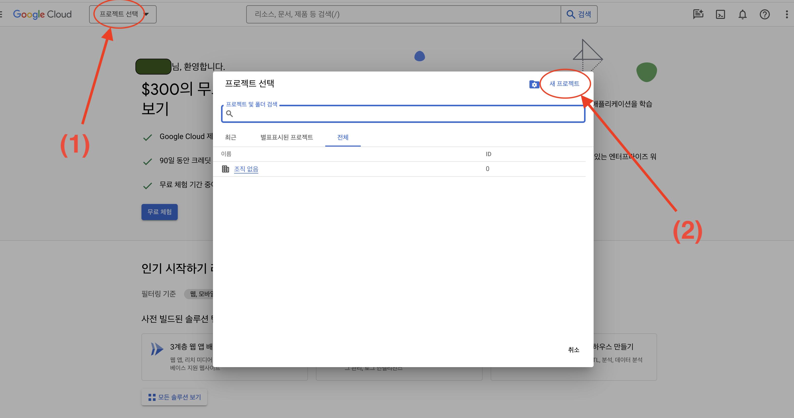
<br>

프로젝트 이름을 자유롭게 작성하여 프로젝트 생성 후, 아래 우측 그림처럼, 만들어진 프로젝트를 선택해준다. 이후, 좌측최상단 더보기탭을 눌러 <API 및 서비스> - <라이브러리>에 들어가도록 한다.
<table><tr>
<td> 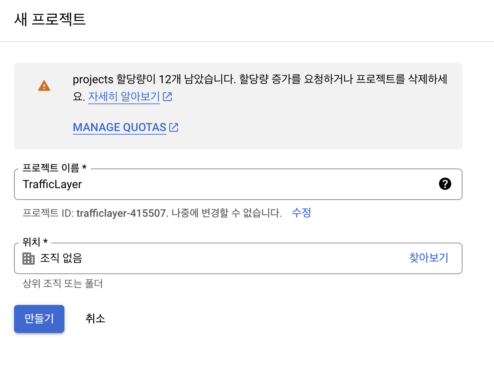 </td>
<td> 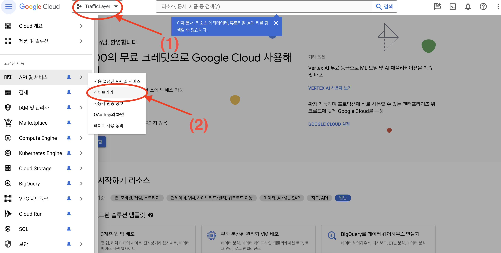 </td>
</tr></table>
<br>

라이브러리에서 "Map JavaScript API"를 눌러 '사용'을 클릭해 약관 동의 절차를 진행한다.

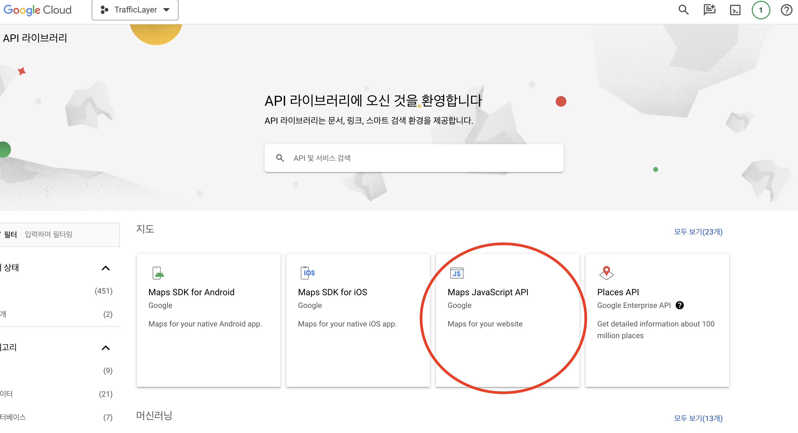
<br>

이 때, 결제 정보 입력 과정이 있는데, 이를 입력한다고 당장 무언가가 결제되는 것이 아니니 안심하고 입력해줘도 괜찮다. 
>NOTE! 유료 서비스에 접근하거나 제한된 쿼리 수 이상을 호출하려고 할 시, 결제 청구 알람이 따로 온다고 하니 이 점만 잘 인지하고 있으면 된다. 

<br>

<br>

중간에 약관이나 키제한여부(나는 '나중에'를 눌러 스킵), 사용목적설문 등 부수적인 절차를 완료하고, 대충 여기까지 오면 API 발급은 끝이다. 발급된 API 키는 다시 좌측최상단 더보기탭에서 <API 및 서비스> - <사용자 인증 정보>에 들어가, 아래 그림처럼 '키표시'를 눌러 확인할 수 있다.

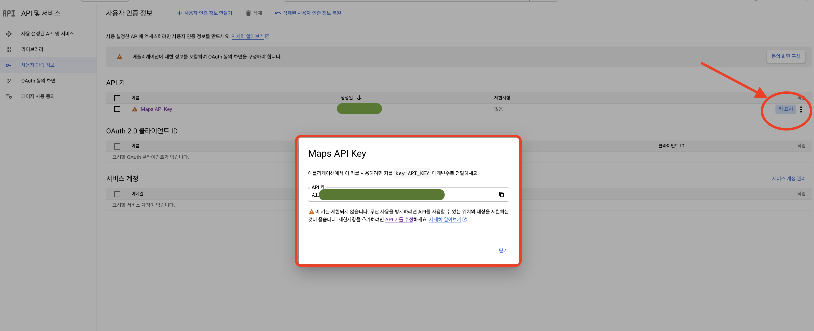
<br>

## 2) API 키 환경변수 설정
API 키는 여러 군데에 노출시켜봤자 좋을게 없으므로, **.bash_profile**에서 시스템 환경변수로 설정시켜놓고 이를 사용하도록 하자.

<br>
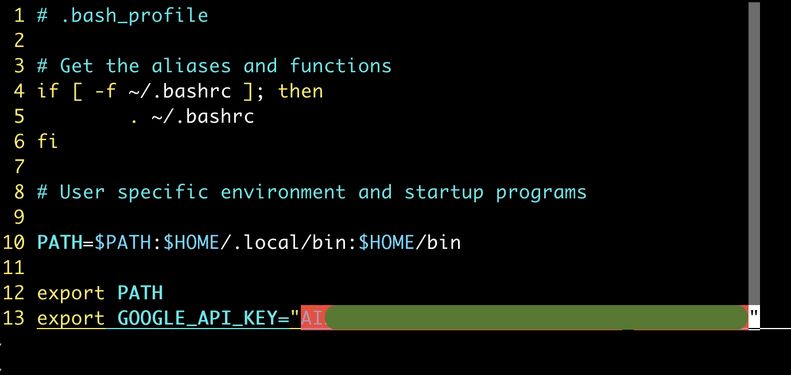
<br>

## 3) Crawling Procedure
여기까지 기초적인 준비는 모두 끝났다. 앞으로 map.html, app.py, CrawlingGmapTraffic.py 이름의 3가지 스크립트 파일을 소개할 건데, 이들을 서로 유기적으로 얽혀 구글맵 실시간 교통정보 이미지를 크롤링하게 된다. 

<br>
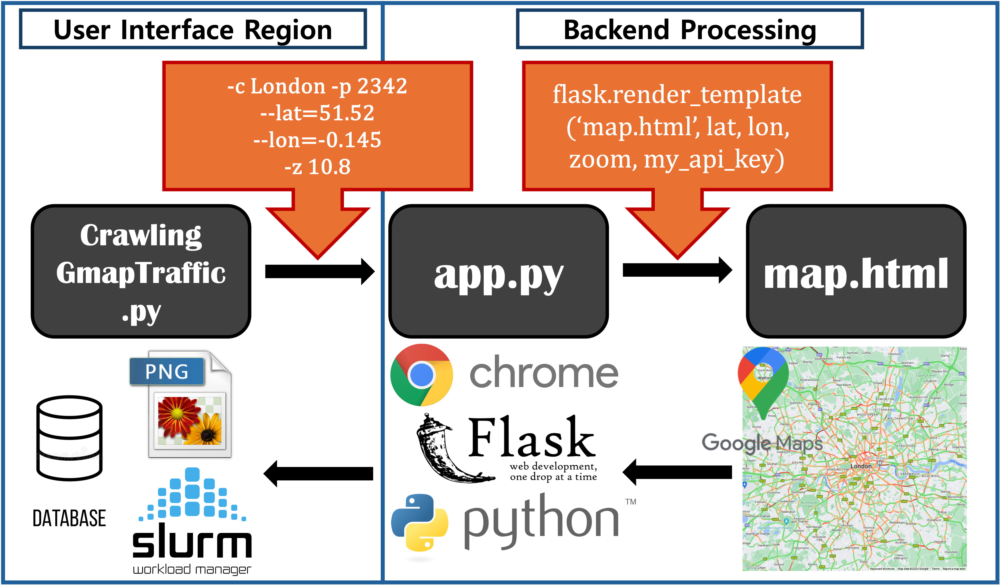
<br>

실시간 교통정보 데이터 수집을 위해, 떠올린 개략적 계획은 다음과 같았다.
1. 특정 위치의 실시간 Google Traffic Layer를 웹(Web)에 띄우기.
2. 해당 웹을 직접 열어서, Web Screenshot(일명 화면캡쳐)을 찍어 PNG 파일로 저장시키기.
3. 5분 마다 1,2번 과정 반복. 

최초 CrawlingGmapTraffic.py 에서 '사용자가 원하는 입력값', **도시 이름 / 크롤링할 전용 포트번호 / 위도 & 경도 / 줌 스케일** 을 입력하면, 이 입력값들이 app.py 스크립트로 전달된다. 작업의 단순성을 높이고, 작업간 종속변수 에러를 최소화하기 위해, 사용자가 신경써야할 부분을 CrawlingGmapTraffic.py 에만 집중되도록 구성했다 (User Interface Region). 이후 CrawlingGmapTraffic.py 은 app.py를 동작시킨다. app.py 스크립트는 **python flask 라이브러리**를 사용하여, 내가 원하는 정보를 웹에 렌더링시키는 역할을 한다. 이 경우 '내가 원하는 정보'란 당연히 Google Map Traffic Layer고, 이는 map.html 파일에 기술되어 있고 이를 기반으로 웹에 정보가 표현된다. map.html은 HTML(웹 페이지 구조를 정의)/CSS(웹 페이지 스타일 정의)/JavaScript(웹 페이지 동작을 정의) 세 가지 언어를 통해 Google Maps 교통정보를 웹에 어떻게 표시할 것인지 정의한 내용이 담겨 있다.

입력값 전달과 스크립트 동작은 이런 식으로 진행되고, 이후 데이터를 수집하는 과정은 역순으로 진행된다. map.html (구글맵을 웹에 표현하는 방식을 정의)에서 나타낸 특정 위치의 실시간 교통정보를 app.py가 Web에 실제로 렌더링하고, CrawligGmapTraffic.py에서 이 Web을 **호출 및 캡쳐**하여 데이터화시키게 된다.

이제 스크립트를 하나하나 간단히 살펴보고, 실제로 동작까지 시켜 출력된 결과물이 어떤 지 확인해보자.

## 4) map.html
```html
<!DOCTYPE html>
<html lang="en">
<head>
    <meta charset="UTF-8">
    <meta name="viewport" content="width=device-width, initial-scale=1.0">
    <title>Your Map Page</title>

    <script src="https://maps.googleapis.com/maps/api/js?v=3.36&key={{ api_key }}&callback=
    initMap" async defer></script> 

    <style>
        #map {
            height: 800px;
            width: 800px;
            margin: 0px;
            padding: 0px;
        }
    </style>
</head>
<body>

    <div id="map"></div>

    <script>
        function initMap() {
            var map = new google.maps.Map(document.getElementById("map"), {
                zoom: {{ zoom }},
                center: new google.maps.LatLng({{ lat }}, {{ lon }}),
                mapTypeId: google.maps.MapTypeId.ROADMAP,
                disableDoubleClickZoom: true,
                draggable: false,
                scrollwheel: false,
                panControl: false,
                disableDefaultUI: true,
                styles: [{
                    "stylers": [{
                        "visibility": "{{ visible }}"
                    }]
                }]
            });

            var trafficLayer = new google.maps.TrafficLayer();
            trafficLayer.setMap(map);
        }
    </script>

</body>
</html>
```

map.html 파일은 앞서 이야기했듯이 app.py 스크립트가 렌더링하게 되는 대상이다. CrawlingGmapTraffic.py 단계에서 입력받은 인자값들을 {{ variable }}로 변수 호출하여 API_KEY, 관찰하고자 하는 영역(위도 & 경도), 줌스케일, Background Layer On/Off 정보를 입력시켜 웹에 띄우게 된다.

> IMPORTANT:: map.html 스크립트는 현재 작업 위치에서 'templates'이란 이름의 디렉토리 안에 넣어놓고 쓰기를 권장한다. 사실상 이 모든 작업의 (조심스럽게 다뤄야 할) 코어 부분이기도 하기에, 개별적으로 관리해야할 필요성이 있다고 생각되기 때문이다. 별로 동의하지 않는다면, app.py 스크립트에서 template_folder 값을 변경하고 사용하라.
```
Flask(__name__, template_folder='templates')
```

Google Maps을 불러오는 이 스크립트를 작성할 때, 지역 라벨 표시나 지형 표시 등의 배경을 제거하고 순수하게 Traffic Layer만 나타나도록 코드를 어떻게 작성해야하는 줄 몰라서 애를 많이 먹었다. 다른 사람들의 HTML 스크립트들을 구글링하고, 직접 따라해보고, 코드줄을 첨가해보고 또는 빼보고 같은 시행착오를 거친 결과, 아래 코드 단락을 google.map.Map() 에 추가해주고 visibility 부분을 option 변수로 달아주면 쉽게 on/off 되는 걸 알게 되었다. 
```
styles: [{
    "stylers": [{
        "visibility": "{{ variable }}"
    }]
}]
```

<br>
<br>

만약 위치와 줌스케일을 입력했을 때, 대략 어떻게 출력될지 또는 어떻게 보일지가 궁금하다면, 위 html 스크립트를 돌려보는 아주 간단한 방법이 있다. JSFiddle 이라는 HTML, CSS, JavaScript 코드를 자유롭게 작성하고 테스트할 수 있는 웹 서비스 환경이 있는데, 코드 작성 후 즉시 결과를 확인할 수 있으며 본인의 작업물에 영향없이 사람들과 코드와 결과를 쉽게 공유할 수 있다. [여기](https://jsfiddle.net/zoshs2/93dak5zj/35/)에 들어가면 내가 사용하던 jsfiddle 테스트 코드를 볼 수 있는데, 여기서 줌 스케일과 위도, 경도를 변경하고 ctrl + enter 로 결과를 바로 확인할 수 있다.

## 5) app.py

Flask 라이브러리를 통해 map.html을 웹 형태로 렌더링시키고, 접속할 수 있는 URL 포트번호, 특정 웹 URL Postfix를 주었을 때 동작 방식 등이 여기에 정의되어 있다. 앞서 이야기했듯이 이 스크립트 역시 유저가 직접 수정해야할 부분은 없지만, 스크립트 내 **NOTE**라고 표시되어 있는 코드 단락의 의미를 보고, 미리 준비가 되어 있는지 (저장될 파일이름, API_KEY 환경변수 설정, templates 디렉토리 설정 - map.html)만 살피면 되겠다. 

추가적으로, app.py 스크립트는 웹을 띄울 때 chrome browser를 사용하도록 설정시켜뒀는데, 이를 위해 **크롬 실행파일(바이너리 파일)과 크롬 드라이버**를 다운받아야 한다. 이 파일들은 [Chrome + ChromeDriver releases](https://googlechromelabs.github.io/chrome-for-testing/)에 들어가서 Stable 버전의 chrome과 chromedriver를 다운받아 압축 해제 후 사용하면 된다. 

```
>>> wget https://storage.googleapis.com/chrome-for-testing-public/122.0.6261.94/linux64/chrome-linux64.zip
>>> wget https://storage.googleapis.com/chrome-for-testing-public/122.0.6261.94/linux64/chromedriver-linux64.zip
```

여기서 한번 정리하자면, 결국 사용할 파일 및 스크립트들의 tree 구조를 아래와 같이 구성시키면 된다.
```
/home/myName/gmap_workspace/
├── CrawlingGmapTraffic.py
├── app.py
├── chrome-linux64
│   └── chrome
├── chromedriver-linux64
│   └── chromedriver
└── templates
    └── map.html
```

## 6) CrawlingGmapTraffic.py
이 스크립트도 사실 특별할 건 없다. 크롤링을 진행할 때, 이 스크립트만 동작시키면 app.py, map.html 이 순차적으로 동작한다. 
<br>
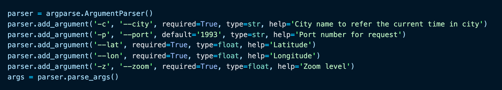
<br>
입력해줘야할 건, (London, Paris 같은) 도시이름, (웹을 띄우고, Download URL 경로로 활용할) 포트번호, 위도 & 경도(Latitude & Longitude), 줌스케일 (Zoom)이 전부다. 

* * *
다만, 입력한 **도시이름**이 이 크롤링 작업에서 어떻게 쓰이는 지 알아둘 필요가 있다. 나는 처음 어떤 '도시이름'을 입력하든지, 해당 도시 위치의 현지 시간을 도출하도록 하고 싶었다. 일종의 timezone(영역시간대)를 얻어서, 나중의 PNG파일의 이름으로 사용해 기록해야했다. 이 과정에서 [pytz](https://pypi.org/project/pytz/)란 파이썬 유저들이 많이 사용하는 글로벌 시간대 라이브러리를 알게 되었고, 이를 내 스크립트에도 적용하게 되었다. 
<br>
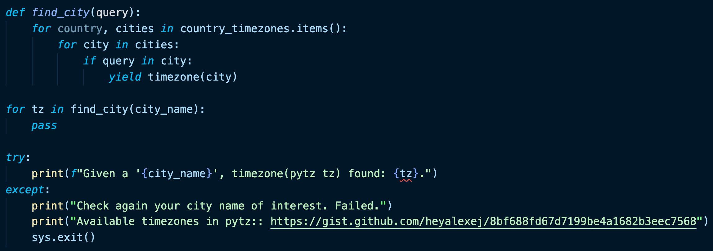

여기서 유념해야할 점은, 이 방식의 한계이기도 한데,,, pytz에 리스트업이 안된 도시이름은 사용할 수 없다는 것이다. 코드에서 보다시피, pytz에서 찾을 수 없는 도시이름(영문)을 입력시 에러를 띄우고 종료되게끔 만들었다. pytz에 리스트업된 도시이름은 [여기](https://gist.github.com/heyalexej/8bf688fd67d7199be4a1682b3eec7568)에 들어가 미리 살펴볼 수 있다. 수백여개의 도시가 들어 있어서 대부분 문제가 없긴 하다.

* * *
<br>
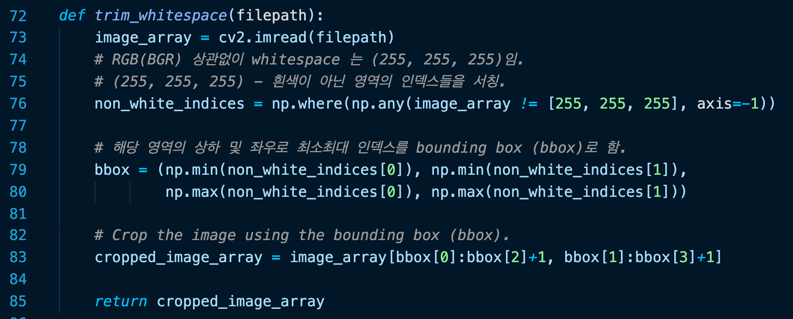

그리고 스크립트 안에는 **trim_whitespace**라는 함수가 있는데, 이 함수는 구글맵 이미지를 캡쳐하고 저장할 때마다, 그 직후 바로 쓸모없는 부분을 잘라내고 **재저장**하는 역할을 수행한다. 이게 무슨 말이냐면, 사실 웹에 구글맵을 띄워서 이를 스크린샷으로 찍어 저장시키면 아래와 같은 **쓸모없는 하얀 여백**을 포함한 이미지가 저장된다.
<br>


이런 dummy 부분은 전혀 필요없는 부분이기 때문에, 이미지를 캡쳐 및 저장 직후 trim해서 재저장하는 것이다. 그래서 처음 저장된 png파일은 trim이후 삭제된다.

* * *
현재 내가 마지막으로 설정해둔 크롤링 time interval은 **5분**으로 되어 있다. while True문 안에서 현재 시간을 계속 도출하며, 00/05/10/.../50/55분인지 체크하고 이 때마다 크롤링을 진행하게 된다. 
<br>
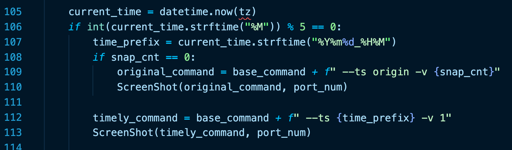

그리고, 첫 크롤링 시도 때는 항상 (background) visibility 'on' 으로 이미지를 한 장 더 뽑아내도록 만들었다. Real space에서 어디에 해당하는 도로 영역인지 나중에 비교할 때 사용할 수 있을 것이다.
* * *
이제 이 CrawlingGmapTraffic.py 스크립트를 터미널에서 실행시키기만 하면 된다. 
```
> python CrawlingGmapTraffic.py -c London -p 2342 --lat=51.52 --lon=-0.145 -z 10.8
```
적절한 위도 & 경도좌표는 [구글맵](https://www.google.co.kr/maps/?hl=ko)에서 원하는 도시를 검색해서 마우스 오른쪽 버튼을 눌러 확인할 수 있다.
<br>


> NOTE!!! 참고로, 구글맵에서 실시간 교통정보를 제공하지 않는 도시들이 있다. 대표적으로 우리 대한민국이 그렇다. 그렇기 때문에, 실시간 교통정보 크롤링을 하고 싶은 도시가 있다면, 그전에 먼저 구글맵에 들어가 좌측하단 레이어에서 '교통정보' 레이어를 볼 수 있는 도시인지 먼저 확인하길 바란다. 

## 7) Run with Slurm Manager
위 크롤링 파일을 단순히 돌리려면, 아래 커맨드를 터미널에서 사용하면 된다.
```
> python CrawlingGmapTraffic.py -c London -p 2342 --lat=51.52 --lon=-0.145 -z 10.8
```
그런데 만약 여러 목적 도시들을 한꺼번에 돌리고, 이들의 JOB SCHEDULE을 효율적으로 관리하고 싶다면 [Slurm](https://slurm.schedmd.com/documentation.html){:target='_blank'} 을 사용하면 된다. 


Crawlist 파일 내용은 이런 식으로 작성하여...
```
-c Moscow -p 2350 --lat=55.7512 --lon=37.6201 -z 13.3
-c London -p 2341 --lat=51.52 --lon=-0.145 -z 10.8
-c Paris -p 2342 --lat=48.859 --lon=2.337 -z 12.7
-c New_York -p 2343 --lat=40.713 --lon=-74.043 -z 10.6
-c Chicago -p 2344 --lat=41.87 --lon=-87.64 -z 10.8
-c Bogota -p 2345 --lat=4.65402 --lon=-74.0893 -z 11.9
-c Toronto -p 2346 --lat=43.72606 --lon=-79.37394 -z 11
-c Monterrey -p 2347 --lat=25.67568 --lon=-100.31028 -z 11.6
-c Istanbul -p 2348 --lat=41.042283 --lon=28.981292 -z 11.2
-c Bangkok -p 2349 --lat=13.765897 --lon=100.576105 -z 10.6
```
> 이 도시들은 ['23년 초 교통체증 세계 주요 도시 순위' 기사](https://biz.heraldcorp.com/view.php?ud=20230201000652)를 보고 선정했었다.

위 10개 도시에 대한 JOB들을 한번에 개별 JOB으로 던져 작업할 수 있다.

Slurm Command-line Tips in Terminal.
* ```> squeue```: 현재 Slurm Job list 보여준다.
* ```> scancel -u <user_name>```: <user_name>의 Job들을 모두 삭제한다.

# Image Raw Dataset to Regularized 2D Dataset

위 스크래핑 프로그램으로 수집한 구글맵 교통정보 이미지를 어떤 식으로 전처리할 지에 대한 아이디어는, 23년 11월 Physical Review E 저널에 실린 [Ebrahimabadi, Sasan, et al. "Geometry of commutes in the universality of percolating traffic flows."](https://doi.org/10.1103/PhysRevE.108.054311){:target="_blank"} 논문을 참고했다. 

요약하자면, 3차원(RGB) 텐서 행렬의 이미지 데이터를 2차원으로 투영시키고 MaxPooling으로 주변 픽셀 정보들을 압축해서 표현하는 전처리 과정이다.

본 글에서는 그 전처리에 대한 일부 결과들만 소개한다. 

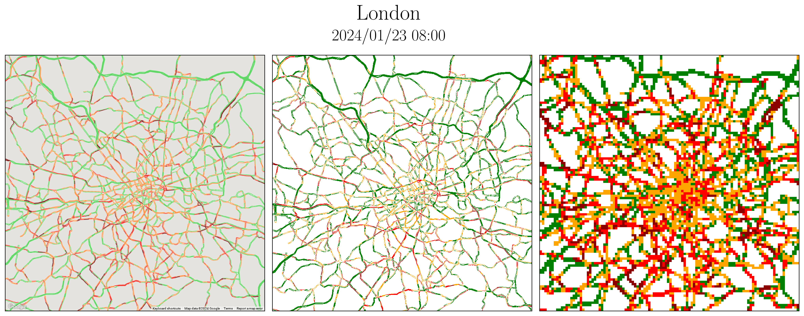*24년 1월 23일 (화) 영국 런던의 오전 8시 도심 아침 교통 상황*

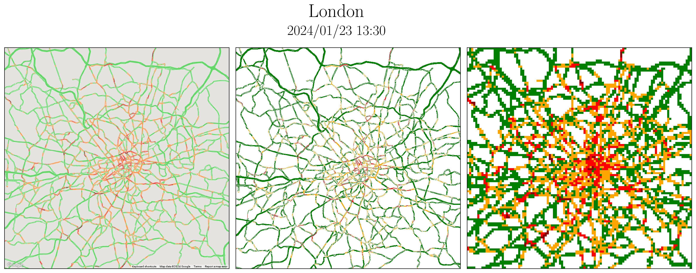*24년 1월 23일 (화) 영국 런던의 오후 1시 30분 도심 점심(낮) 교통 상황*

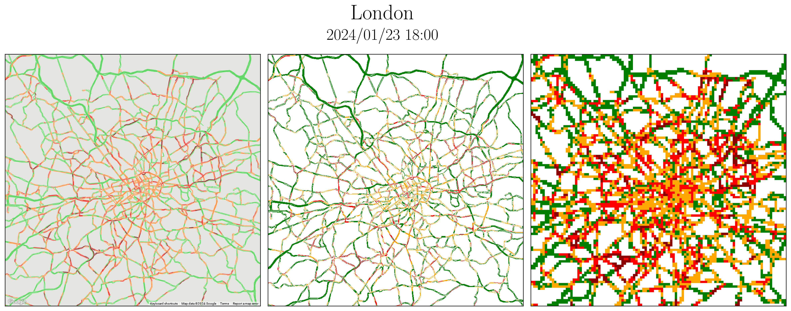*24년 1월 23일 (화) 영국 런던의 오후 6시 도심 저녁 교통 상황*

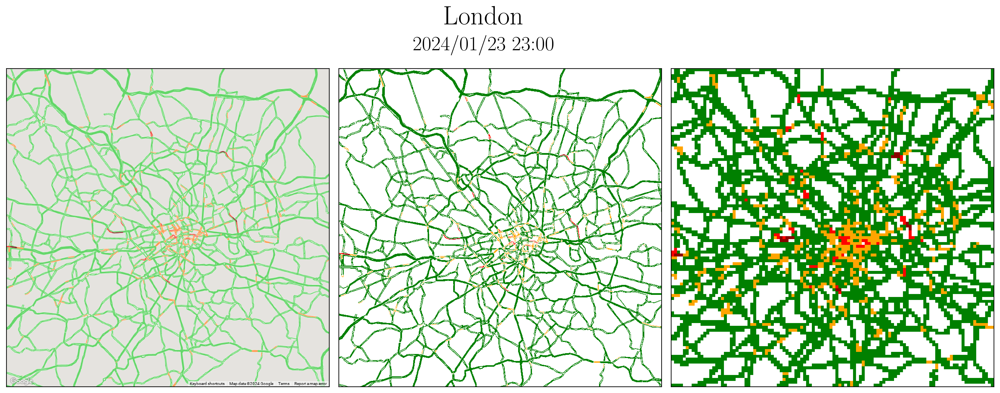*24년 1월 23일 (화) 영국 런던의 오후 11시 도심 야간 교통 상황*